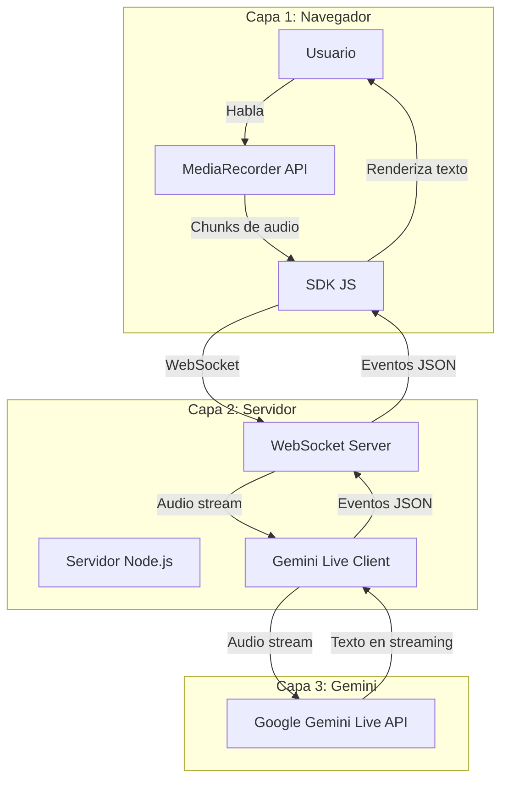
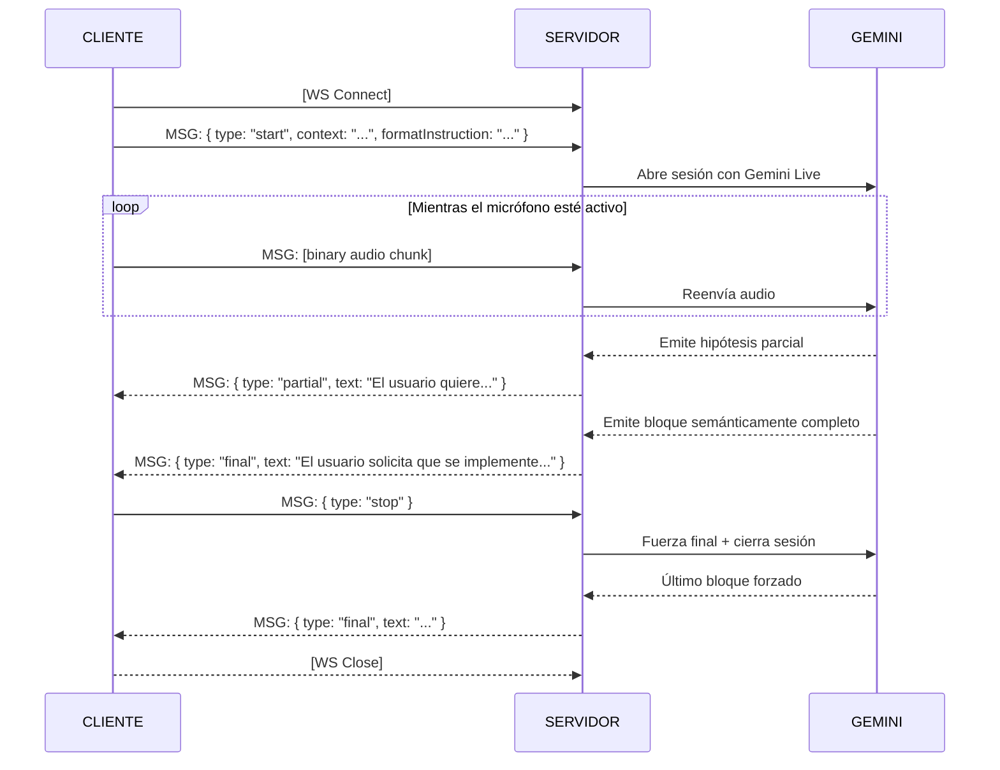

# Arquitectura del Sistema

> Documento derivado del [Brief v0.1](brief-0.1.md). Describe la estructura de capas, el flujo de datos y las decisiones de comunicación de Chaman-ear.

> **Version 0.1 — Sujeta a cambios.** Esta es la primera iteracion de la arquitectura. Se espera que evolucione a medida que se validen las decisiones durante la implementacion. El agente programador debe proponer activamente cambios o mejoras cuando encuentre fricciones, limitaciones tecnicas o mejores alternativas durante el desarrollo. Lo importante es que cualquier cambio propuesto se registre y se discuta antes de implementarse.

---

## 1. Vista General

Chaman-ear se compone de **tres capas** que operan en secuencia lineal. No hay componentes opcionales ni ramificaciones en la v0.1: todo el audio fluye en una dirección y todo el texto fluye en la dirección contraria.



### Capas

| Capa | Responsabilidad | Tecnología | Ejecución |
|------|----------------|------------|-----------|
| **Navegador** | Captura de audio, renderizado de texto, gestión del contexto del usuario | SDK JS (npm) + App Demo (HTML/CSS/JS) | Cliente (browser) |
| **Servidor** | Proxy inteligente: recibe audio del cliente, lo reenvía a Gemini, traduce la respuesta en eventos estructurados | Node.js + WebSocket server | Servidor (local o cloud) |
| **Gemini** | Reconocimiento de voz + reformulación semántica en un solo paso (ASR + LLM unificados) | Google Gemini Live API | Servicio externo (Google) |

---

## 2. Flujo de Datos

El flujo completo para una sesión de dictado es el siguiente:

```
USUARIO habla
    |
    v
[1] MediaRecorder captura chunks de audio (WebM/Opus)
    |
    v
[2] SDK JS envía cada chunk por WebSocket al Servidor
    (junto con contexto + instrucción de formato en el mensaje inicial)
    |
    v
[3] Servidor reenvía el stream de audio a Gemini Live API
    (incluyendo el system prompt construido a partir del contexto del usuario)
    |
    v
[4] Gemini procesa el audio y emite texto en streaming
    |
    v
[5] Servidor traduce la salida de Gemini en eventos tipados:
    - "partial": hipótesis inestable (texto en formación)
    - "final":   bloque semánticamente completo (texto validado)
    |
    v
[6] SDK JS recibe los eventos y dispara callbacks:
    - onPartial(text) -> renderiza en gris / cursiva
    - onFinal(text)   -> solidifica como texto definitivo
    |
    v
USUARIO ve texto limpio y refinado en pantalla
```

### Notas sobre el flujo

- **Pasos 1-2** ocurren de forma continua mientras el micrófono esté activo. No hay buffering largo: cada chunk de audio se envía inmediatamente.
- **Paso 3**: El servidor no almacena ni procesa el audio de ninguna forma. Actúa exclusivamente como proxy, añadiendo el contexto del usuario como system prompt para Gemini.
- **Pasos 4-5**: La decisión de emitir `partial` vs `final` la toma Gemini basándose en completitud semántica. El servidor parsea la respuesta de Gemini y la empaqueta como evento JSON.
- **Un caso especial**: Cuando el usuario suelta el botón del micrófono, el SDK llama a `stop()`. El servidor fuerza un evento `final` con el texto pendiente y cierra la conexión.

---

## 3. Protocolo de Comunicación: WebSocket

### Por qué WebSocket (y no HTTP streaming, SSE, etc.)

La razón más determinante: **Google Gemini Live API utiliza WebSocket internamente** como su protocolo de comunicación. Esto significa que el servidor ya necesita mantener una conexión WebSocket abierta con Gemini durante toda la sesión de dictado. Usar el mismo protocolo entre el cliente y el servidor elimina la necesidad de traducir entre protocolos y simplifica drásticamente la arquitectura del servidor, que actúa esencialmente como un proxy WebSocket-a-WebSocket.

Además, frente a las alternativas:

| Alternativa | Problema |
|-------------|----------|
| HTTP + SSE (Server-Sent Events) | Unidireccional (servidor -> cliente). No permite enviar audio del cliente al servidor por el mismo canal. |
| HTTP POST + polling | Latencia inaceptable para tiempo real. |
| WebRTC | Excesivamente complejo para este caso de uso. Diseñado para peer-to-peer, no cliente-servidor. |
| **WebSocket** | **Bidireccional, baja latencia, soporte nativo en navegadores. Mismo protocolo que usa Gemini Live internamente: el servidor actúa como proxy WS-a-WS sin traducción.** |

### Ciclo de vida de la conexión




### Tipos de mensaje

**Cliente -> Servidor:**

| Tipo | Formato | Descripción |
|------|---------|-------------|
| `start` | JSON | Inicia la sesión. Contiene `context` e `formatInstruction`. |
| audio | Binario | Chunk de audio crudo (WebM/Opus). Sin wrapper JSON. |
| `stop` | JSON | Señal de cierre. Fuerza un evento `final` pendiente. |

**Servidor -> Cliente:**

| Tipo | Formato | Descripción |
|------|---------|-------------|
| `partial` | JSON | Hipótesis inestable. Campo `text` con el contenido parcial. |
| `final` | JSON | Bloque validado. Campo `text` con el contenido definitivo. |
| `error` | JSON | Error de procesamiento. Campo `message` con la descripción. |

---

## 4. Diseño Stateless

La API es **sin estado por diseño**. No existe concepto de "sesión persistente" en el servidor. Cada conexión WebSocket es independiente y autocontenida.

### Qué viaja en cada request

Cuando el cliente abre una nueva conexión y envía el mensaje `start`, incluye **todo** el contexto necesario:

```json
{
  "type": "start",
  "context": "Documento de background del usuario. Puede incluir:\n- Extractos de texto\n- Listas de personajes\n- Hilos de email\n- Glosarios técnicos\n\nHasta ~10 páginas (~3,000-6,000 tokens).",
  "formatInstruction": "Escribe como una especificación técnica en Markdown. Elimina muletillas y organiza las ideas en secciones."
}
```

### Implicaciones del diseño stateless

| Aspecto | Consecuencia |
|---------|-------------|
| **Escalabilidad** | Cualquier instancia del servidor puede atender cualquier conexión. No hay afinidad de sesión. |
| **Simplicidad** | No hay base de datos de sesiones, ni TTLs, ni lógica de reconexión con estado. |
| **Privacidad** | Ningún dato del usuario se persiste en el servidor. El contexto vive exclusivamente en el cliente. |
| **Trade-off** | Cada conexión transmite el contexto completo. Aceptable para el tamaño esperado (3,000-6,000 tokens). |
| **Evolución futura** | Se puede añadir caché de contexto opcional (por hash) sin romper el contrato actual. |

---

## 5. Completitud Inteligente: Implicaciones Arquitectónicas

El principio de **Completitud Inteligente** (definido en detalle en el [Brief v0.1, sección 8](brief-0.1.md#8-completitud-inteligente)) establece que cada evento `partial` no es una transcripción literal, sino una versión limpia, completa e inferida del habla del usuario.

Esta responsabilidad recae **íntegramente en Gemini**, guiado por el system prompt que el servidor construye. Las implicaciones para la arquitectura son:

| Aspecto | Implicación |
|---------|-------------|
| **System prompt** | El servidor debe construir un system prompt que instruya a Gemini a completar frases cortadas, eliminar muletillas, respetar el formato solicitado e inferir el final más probable. Este prompt se construye dinámicamente combinando el `context` y la `formatInstruction` del usuario. |
| **El servidor no post-procesa** | El texto que Gemini devuelve se empaqueta directamente como evento `partial` o `final`. No hay lógica de limpieza, reformulación ni corrección gramatical en el servidor. |
| **Calidad = calidad del prompt** | La calidad de la completitud inteligente depende enteramente del system prompt. Este será uno de los artefactos más iterados durante el desarrollo. |
| **Evaluación** | Se necesita un conjunto de pares entrada/salida esperada (como los ejemplos del Brief) para validar que el system prompt funciona correctamente ante cambios. |

---

## 6. Decisiones Arquitectónicas Clave

| Decisión | Alternativa descartada | Justificación |
|----------|----------------------|---------------|
| Gemini Live como único proveedor | Pipeline ASR + LLM separados | Un solo servicio reduce latencia y complejidad del servidor. |
| WebSocket bidireccional | HTTP + SSE | Gemini Live usa WebSocket internamente. Mismo protocolo en ambos tramos = proxy sin traducción. |
| Stateless (sin sesión) | Estado de sesión en servidor | Simplifica el servidor y protege la privacidad. El trade-off de payload es aceptable. |
| SDK como paquete npm | SDK embebido en la demo app | Reutilizabilidad: cualquier desarrollador puede instalar el SDK en su propia app. |
| Node.js para el servidor | Python (FastAPI/Flask) | Ecosistema natural para WebSockets. Comparte lenguaje con el SDK (JS/TS). Evaluación pendiente (*ver nota*). |
| Completitud inteligente en Gemini | Post-procesamiento en el servidor | Mantiene el servidor como proxy puro. Toda la inteligencia está en el prompt. |

> **Nota sobre Node.js vs Python:** La elección de Node.js como runtime del servidor es una decisión tentativa basada en la afinidad de lenguaje con el SDK. Si la integración con Gemini Live resulta más madura en Python (via `google-genai`), se reevaluará. Esta decisión se confirma en la fase de especificaciones técnicas.
