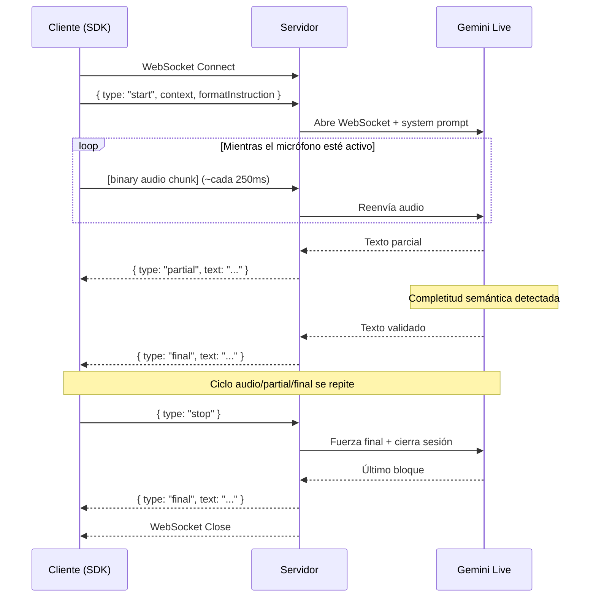

# Especificaciones Técnicas

> Documento derivado de la [Arquitectura](architecture.md) y el [Brief v0.1](brief-0.1.md). Define las interfaces, los contratos de datos y las decisiones tecnológicas concretas para la implementación de Chaman-ear v0.1.

> **Version 0.1 — Sujeta a cambios.** Al igual que la arquitectura, estas especificaciones son un punto de partida. El agente programador debe proponer ajustes cuando la implementación lo requiera.

---

## 1. Interfaz Pública del SDK de JavaScript

El SDK se distribuye como paquete npm (`chaman-ear`) y expone una clase principal con una API mínima orientada a eventos.

### 1.1 Clase `ChamanEar`

> **Nota sobre extensibilidad:** Todas las interfaces de configuración usan campos opcionales. Agregar nuevos campos en versiones futuras (ej. sesiones pregrabadas, caché de contexto, selección de modelo) no rompe la API existente. Los desarrolladores que ya usan el SDK no necesitan cambiar su código.

```typescript
interface ChamanEarConfig {
  /** URL del servidor WebSocket de Chaman-ear */
  serverUrl: string;

  /** Formato de audio preferido. Default: "webm" */
  audioFormat?: "webm" | "ogg";

  /**
   * Intervalo en ms entre envíos de chunks de audio. Default: 250.
   * Valores más bajos = menor latencia pero más mensajes WebSocket.
   * Valores más altos = mayor latencia pero menos overhead de red.
   * Rango recomendado: 100-500ms.
   */
  chunkInterval?: number;
}

interface SessionParams {
  /** Documento de background / contexto libre (hasta ~10 páginas) */
  context: string;

  /**
   * Instrucción de formato en lenguaje natural. Opcional.
   * Default: "Produce texto limpio y bien redactado. Mantén el idioma original del hablante."
   */
  formatInstruction?: string;
}

class ChamanEar {
  constructor(config: ChamanEarConfig);

  /**
   * Inicia una sesión de dictado.
   * Solicita permiso de micrófono, abre WebSocket y comienza a transmitir audio.
   * @throws MediaError si no hay acceso al micrófono.
   * @throws ConnectionError si no se puede conectar al servidor.
   */
  start(params: SessionParams): Promise<void>;

  /**
   * Detiene la sesión de dictado.
   * Fuerza un evento `final` para el texto pendiente y cierra la conexión.
   */
  stop(): Promise<void>;

  /**
   * Callback: se dispara cuando llega una hipótesis parcial.
   * El texto es inestable y puede ser reemplazado.
   */
  onPartial(callback: (text: string) => void): void;

  /**
   * Callback: se dispara cuando un bloque de texto ha sido validado.
   * El texto es definitivo y no será modificado.
   */
  onFinal(callback: (text: string) => void): void;

  /**
   * Callback: se dispara ante errores de conexión o procesamiento.
   */
  onError(callback: (error: ChamanEarError) => void): void;

  /**
   * Callback: se dispara cuando cambia el estado de la conexión.
   */
  onStateChange(callback: (state: ConnectionState) => void): void;
}

type ConnectionState = "disconnected" | "connecting" | "connected" | "recording" | "stopping";

class ChamanEarError extends Error {
  code: "MEDIA_ERROR" | "CONNECTION_ERROR" | "SERVER_ERROR" | "TIMEOUT";
}
```

### 1.2 Uso típico (ejemplo para desarrolladores)

```javascript
import { ChamanEar } from "chaman-ear";

const ear = new ChamanEar({ serverUrl: "wss://api.chaman-ear.dev" });

ear.onPartial((text) => {
  // Renderizar en gris / cursiva (hipótesis inestable)
  preview.textContent = text;
});

ear.onFinal((text) => {
  // Solidificar como texto definitivo
  output.textContent += text + "\n";
  preview.textContent = "";
});

ear.onError((err) => {
  console.error(`[chaman-ear] ${err.code}: ${err.message}`);
});

// Iniciar dictado (formatInstruction es opcional; usa el default si se omite)
await ear.start({
  context: "Proyecto web de e-commerce. Stack: React, Node, PostgreSQL.",
  formatInstruction: "Produce un prompt conciso para un modelo de código.",
});

// Al soltar el botón del micrófono
await ear.stop();
```

---

## 2. Esquema de Payloads WebSocket

### 2.1 Mensajes del Cliente al Servidor

**Mensaje `start` (JSON):**

```json
{
  "type": "start",
  "context": "<string: documento de background, hasta ~6000 tokens>",
  "formatInstruction": "<string: instrucción de formato en lenguaje natural>"
}
```

**Mensaje de audio (binario):**

Chunk de audio en formato WebM/Opus enviado como mensaje binario de WebSocket, sin wrapper JSON. Cada chunk corresponde a un intervalo de `chunkInterval` ms de grabación.

**Mensaje `stop` (JSON):**

```json
{
  "type": "stop"
}
```

### 2.2 Mensajes del Servidor al Cliente

**Evento `partial`:**

```json
{
  "type": "partial",
  "text": "<string: hipótesis inestable, será reemplazado>",
  "timestamp": "<string: ISO 8601>"
}
```

**Evento `final`:**

```json
{
  "type": "final",
  "text": "<string: bloque validado, texto definitivo>",
  "timestamp": "<string: ISO 8601>"
}
```

**Evento `error`:**

```json
{
  "type": "error",
  "code": "GEMINI_ERROR | AUDIO_FORMAT_ERROR | INTERNAL_ERROR",
  "message": "<string: descripción legible del error>"
}
```

### 2.3 Secuencia completa de una sesión



---

## 3. Estructura del Contexto

El contexto es el mecanismo de personalización de Chaman-ear. Se compone de dos campos independientes que el usuario define antes de iniciar la sesión.

### 3.1 Campo `context`

| Propiedad | Detalle |
|-----------|---------|
| **Tipo** | `string` (texto libre) |
| **Tamaño máximo sugerido** | ~10 páginas (~6,000 tokens) |
| **Propósito** | Proveer información de fondo que Gemini debe considerar al reformular el habla del usuario |
| **Contenidos típicos** | Extractos de documentos, listas de personajes, hilos de email, glosarios técnicos, código fuente, notas previas |
| **Persistencia** | Vive en el cliente. Se envía completo en cada conexión. Nunca se almacena en el servidor. |

### 3.2 Campo `formatInstruction`

| Propiedad | Detalle |
|-----------|---------|
| **Tipo** | `string` (lenguaje natural, formato libre) |
| **Tamaño típico** | 1-3 oraciones |
| **Propósito** | Definir el estilo, tono y formato de la salida |
| **No es** | Un menú de opciones predefinidas. Es completamente abierto. |

### 3.3 Construcción del System Prompt

El system prompt es **un archivo de configuración externo** (`config/system-prompt.txt`), no código fuente embebido. Esto permite iterar sobre el prompt sin tocar el código del servidor ni recompilar.

El servidor lee este archivo al iniciar y sustituye las variables `{context}` y `{formatInstruction}` con los valores de cada sesión. Estructura del archivo:

```
# config/system-prompt.txt

Eres un asistente de dictado inteligente. El usuario te hablará en voz alta.
Tu trabajo es transformar su habla en texto limpio que preserve su intención.

Reglas:
- Elimina muletillas, repeticiones y pausas.
- Corrige la gramática sin alterar el significado.
- Si el usuario corta una frase a la mitad, infiere el final más probable y complétala.
- No inventes contenido nuevo; solo completa lo que el usuario claramente iba a decir.
- Respeta el formato de salida indicado abajo.

Ejemplos de completitud inteligente (ver Brief v0.1, sección 8):
- Entrada: "quiero que eh... mires el repo y me digas tres... tres cosas"
  Salida: "Quiero que analices el repositorio y me propongas tres cosas"
- Entrada: "marlowe le dice a carmen que sabe que estuvo en el almacén esa noche, que tiene un testigo, aunque en realidad no tie..."
  Salida: "Marlowe le dice a Carmen que sabe que estuvo en el almacén esa noche y que tiene un testigo, aunque en realidad no tiene ninguna prueba."

[CONTEXTO DEL USUARIO]
{context}

[FORMATO DE SALIDA]
{formatInstruction}
```

> **Este archivo es el artefacto más crítico del proyecto.** Su calidad determina directamente la calidad de la salida. Se iterará extensamente durante el desarrollo y debe tener su propio historial de versiones en el log.

---

## 4. Contrato de la API del Servidor

### 4.1 Endpoint único

| Propiedad | Valor |
|-----------|-------|
| **Protocolo** | WebSocket (`wss://`) |
| **Ruta** | `/ws` |
| **URL completa (desarrollo)** | `ws://localhost:3000/ws` |
| **URL completa (producción)** | `wss://api.chaman-ear.dev/ws` |

No hay endpoints HTTP REST. Toda la comunicación ocurre sobre WebSocket.

### 4.2 Responsabilidades del Servidor

El servidor (que operará exclusivamente entorno **localhost**) actúa como **proxy WebSocket-a-WebSocket** con las siguientes responsabilidades:

1. **Recibir** el mensaje `start` del cliente y extraer `context` + `formatInstruction`.
2. **Construir** el system prompt combinando las instrucciones base + contexto + formato.
3. **Abrir** una conexión WebSocket con la API de Gemini Live, enviando el system prompt.
4. **Reenviar** los chunks de audio binario del cliente a Gemini.
5. **Traducir** la respuesta de Gemini en eventos tipados (`partial`, `final`) y enviarlos al cliente.
6. **Manejar** el mensaje `stop`: forzar un evento `final` para texto pendiente y cerrar ambas conexiones.
7. **Reportar** errores al cliente mediante eventos `error`.

### 4.3 Lo que el Servidor NO hace

*   No almacena audio ni texto.
*   No post-procesa ni corrige el texto de Gemini.
*   No mantiene estado entre conexiones.
*   No autentica usuarios (fuera de alcance v0.1).
*   No limita velocidad ni cuotas (fuera de alcance v0.1).

---

## 5. Stack Tecnológico

### 5.1 SDK de JavaScript (Cliente)

| Componente | Tecnología | Justificación |
|------------|-----------|---------------|
| Lenguaje | TypeScript | Tipos estáticos para la API pública. Se compila a JS para distribución. |
| Captura de audio | `MediaRecorder` API (nativa del navegador) | Universal, sin dependencias externas. |
| Formato de audio | WebM/Opus | Soportado nativamente por MediaRecorder en Chrome, Firefox, Edge. |
| Comunicación | `WebSocket` API (nativa del navegador) | Sin librerías adicionales. |
| Bundler | `tsup` o `esbuild` | Ligero, rápido, produce ESM y CJS. |
| Distribución | npm | Estándar de la industria para paquetes JS. |
| Tests | `vitest` | Rápido, compatible con TypeScript sin configuración. |

### 5.2 Servidor (API)

| Componente | Tecnología | Justificación |
|------------|-----------|---------------|
| Runtime | Python (FastAPI) | Decisión estratégica. Permite desarrollo ágil de APIs con fácil integración a librerías de IA y manejo nativo de WebSocket. |
| WebSocket server | `websockets` + `fastapi` | Combina asincronía y ruteo estructurado para WebSocket. |
| Integración Gemini | `google-genai` o WebSocket directo | Dependiente de la API de Gemini Live disponible. Investigar en Fase 0/2. |
| Tests | `pytest` | Framework estándar en Python que se alinea con la directiva TDD. |

### 5.3 Aplicación de Demostración

| Componente | Tecnología | Justificación |
|------------|-----------|---------------|
| Estructura | HTML + CSS + JS vanilla | Mínima complejidad. La demo no necesita un framework. |
| Estilo | CSS custom (tema oscuro) | Alineado con la visión del brief (fondo oscuro, texto que solidifica). |
| Dependencia | `chaman-ear` (el propio SDK) | Dogfooding: la demo usa el SDK como cualquier usuario lo haría. |
| Despliegue | `localhost` | El alcance exclusivo de la aplicación web y del backend es modo local. |

### 5.4 Herramientas de Desarrollo

| Herramienta | Propósito |
|-------------|----------|
| `pnpm` | Gestor de paquetes (rápido, uso eficiente de disco). |
| Monorepo (workspaces) | Un solo repositorio para SDK + servidor + demo. |
| `vitest` | Testing unitario y de integración (SDK y servidor). |
| `prettier` | Formateo de código consistente. |
| `eslint` | Linting estático. |

### 5.5 Metodología de Desarrollo: TDD

El modelo de desarrollo sigue **Test-Driven Development (TDD)** estricto:

```
1. Escribir el test        -->  Define el comportamiento esperado
2. Ejecutar el test        -->  Falla (RED) — confirma que el test es válido
3. Implementar la feature  -->  Código mínimo para que el test pase
4. Ejecutar el test        -->  Pasa (GREEN) — confirma la implementación
5. Refactorizar            -->  Mejorar sin romper el test
```

Este ciclo aplica a cada feature, bugfix y mejora. Ninguna fase se considera completa hasta que todos los tests pasen.

---

## 6. Puntos Abiertos para Investigación

Estos puntos deben resolverse durante las primeras fases de implementación:

| Punto | Pregunta | Impacto |
|-------|----------|---------|
| **Gemini Live API** | ¿La API acepta WebSocket nativo desde Node.js, o requiere su SDK oficial (`google-genai`)? | Define si el servidor usa WebSocket directo o una librería wrapper. |
| **Node.js vs Python** | ¿La integración con Gemini Live es más madura en Python? | Podría cambiar el runtime del servidor. |
| **Formato de audio** | ¿Gemini Live acepta WebM/Opus directamente, o requiere PCM/WAV? | Si requiere PCM, el servidor necesitaría transcodificar o el SDK debería capturar en PCM. |
| **Eventos parciales** | ¿Gemini Live emite hipótesis parciales nativamente, o solo emite texto cuando considera una unidad completa? | Define si los eventos `partial` son nativos de Gemini o los debe sintetizar el servidor. |
| **Límites de contexto** | ¿Cuál es el límite real de tokens del system prompt en Gemini Live? | Define el tamaño máximo real del campo `context`. |
